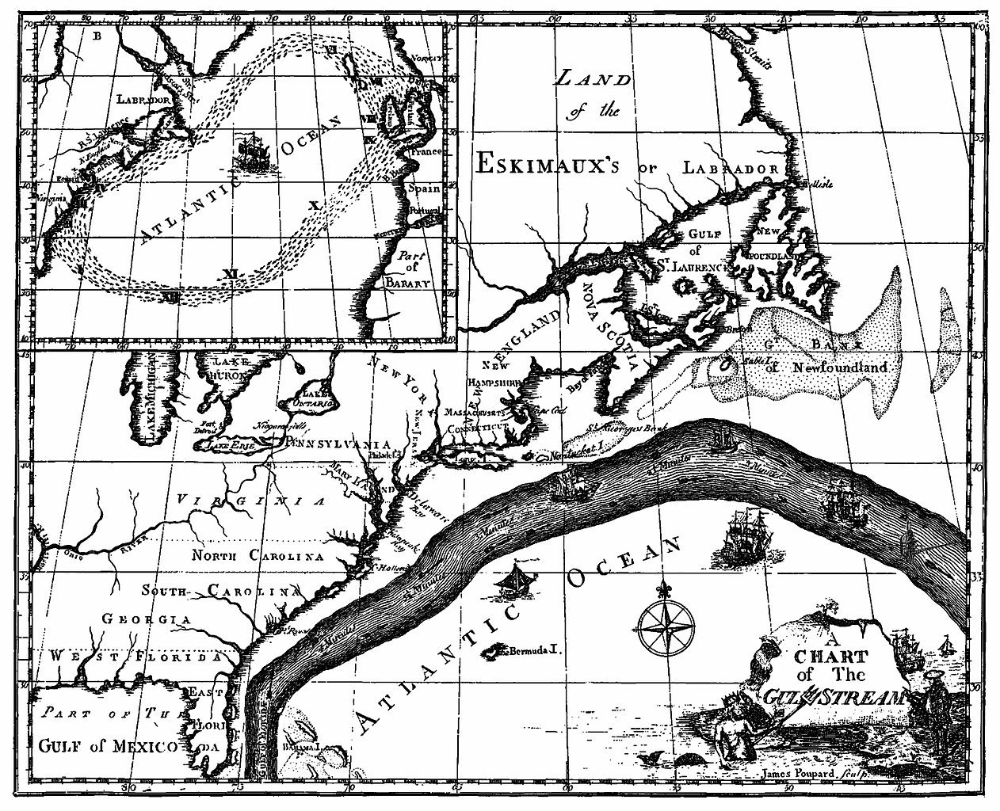
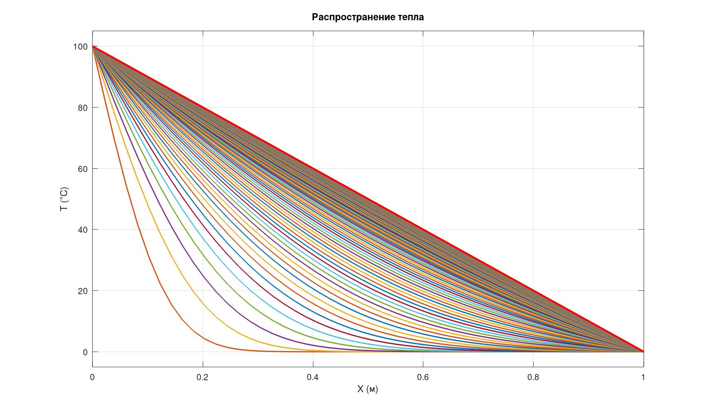

# **Математические модели океанических течений**

**Гркикян Мисак Эдикович**  
группа 601-31

Сургутский государственный университет  
Кафедра прикладной математики

---

## **Актуальность**

- Океан управляет климатом и погодой  
- Течения переносят тепло, вещества, загрязнения

**Математическое моделирование помогает:**
1) прогнозировать климат
2) бороться с разливами нефти
3) обеспечивать безопасность судоходства

➡️ **Основа современной океанологии**

---

## **Как начиналось моделирование**

**1769** — первая карта Гольфстрима  
**1856** — объяснение силы Кориолиса  
**1969** — первая численная модель океана

---

**Карта Гольфстрима, Франклин (1769)**

---

## **Современные модели океана**

**Глобальные модели:**
- NEMO (Европа)
- HYCOM (США)
- INM-CM (Россия)

**Ключевое сегодня:**
- Сетка до **нескольких км**
- Усвоение данных со спутников
- Цифровые двойники океана

---

## **Три главные задачи**

| 🌍 Климат | ♻️ Экология | 🏗️ Инженерная |
|-----------|-------------|---------------|
| Циркуляция океана | Нефтяные разливы | Штормовые нагоны |
| Перенос тепла | Микропластик | Морские сооружения |

---

#### **Основные уравнения гидродинамики океана**

**Уравнение движения:**

$$\frac{\partial \mathbf{u}}{\partial t} + (\mathbf{u} \cdot \nabla) \mathbf{u} + f \mathbf{k} \times \mathbf{u} = -\frac{1}{\rho_0} \nabla_h p + \nabla \cdot (\nu \nabla \mathbf{u}) + \mathbf{F}$$

**Гидростатическое приближение:**

$$\frac{\partial p}{\partial z} = -\rho g$$

**Уравнение неразрывности:**

$$\nabla \cdot \mathbf{u} = 0$$

---

#### **Перенос тепла, солёности и уравнение состояния**

**Уравнение переноса температуры:**

$$\frac{\partial T}{\partial t} + \mathbf{u} \cdot \nabla T = \nabla \cdot (K_T \nabla T) + \frac{Q}{\rho c_p}$$

**Уравнение переноса солёности:**

$$\frac{\partial S}{\partial t} + \mathbf{u} \cdot \nabla S = \nabla \cdot (K_S \nabla S)$$

**Уравнение состояния морской воды:**

$$\rho = \rho(T, S, p)$$

---

## **Учебный пример: одномерная теплопроводность**

$$\frac{\partial T}{\partial t} = \alpha \frac{\partial^2 T}{\partial x^2}$$

**Граничные условия:**
$$T(0,t) = 100^\circ C, \quad T(L,t) = 0^\circ C$$

**Начальное условие:**
$$T(x,0) = 0^\circ C, \quad 0 < x < L$$

---

## **Численное решение (явная схема)**

**Конечно-разностная аппроксимация:**

$$T_i^{n+1} = T_i^n + \sigma \left( T_{i+1}^n - 2T_i^n + T_{i-1}^n \right)$$

$$\sigma = \frac{\alpha \Delta t}{(\Delta x)^2}$$

**Условие устойчивости:**

$$\sigma \le 0.5$$

---

---

## **Выводы**

1. Изучена история развития моделей — от Франклина до цифровых двойников

2. Выделены три главных направления: климат, экология, инженерная безопасность

3. Освоены базовые уравнения и численная реализация на примере теплопроводности

4. Полученные навыки применимы для дальнейшего изучения реальных океанских моделей

---

## **Спасибо за внимание!**
